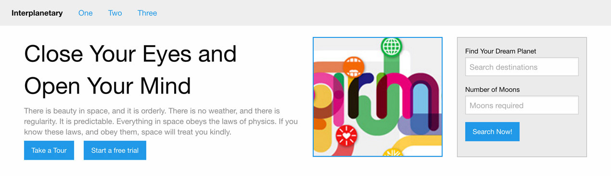

# Lesson 04: HTML Content Elements and CSS Styling Properties

- HTML Content Elements
  - h1, p, a, button, b, i, strong, em, small, sup, sub, code, output, kbd, mark, ul, li, image, video, audio, blockquote, form, label, input, table
- CSS Styling properties
  - backgrounds, border, fonts,
- Create html file and outline code
- Add all html elements
- Style the elements with what we have learnt

## Task

### Part one

Write all the html for the image below - imagine boxes/sectioning elements around areas of content which may not be obvious as part of the design

NB - don't worry about the form for now

### Part Two

Style the HTML you have written with the CSS Styling Properties and layouts you have learnt.

